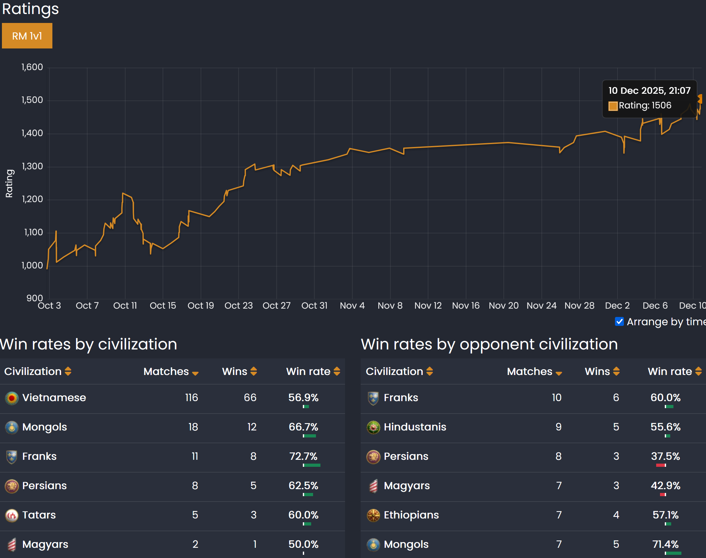

# AoE2 tips going from newcomer to 1500 rating in 3 months

**TL;DR:**

- If you can often beat the Extreme AI in a non-cheese way,
  that is good enough to comfortably play ranked.
- 1000 → 1100: minimize idle Town Center in Dark Age; consistently reach Feudal before 10 minutes with 20-pop Loom.
- 1100 → 1200: use mods to avoid wall holes and idle Town Center.
- 1200 → 1300: still reduce idle TCs, now also in Feudal/Castle Age,
  by using the "Select all Town Centers" hotkey.
- 1300 → 1400: start to remember opponent civilizations and their common strategies.
- 1400 → 1500: use Mangonel and Outpost more often; improve Trebuchet/Castle wars.

I got AoE2 in October 2025, inspired by Spirit Of The Law videos.
I had never played AoE2 before, but I played AoE1 before,
so common controls and strategy concepts were familiar.
With about 200 ranked matches (and many practices vs AI),
I quickly reached a mid-level without much struggle.
I want to share some key tips that helped me pass milestones,
probably **useful for newcomers and casual players** who hesitate to find a ranked match.

## Beating the Extreme AI is ready enough for ranked

Until now, I almost play **only 1 civ and 1 opening** strategy on the **Arabia map**,
and this is a good way to improve quickly,
as you don't need to remember many civilizations and strategies.
I chose Vietnamese civ and the 20-pop Scout opening.
The goal is full walling while attacking with Scouts,
building Farms quickly as wood allows, saving food for Castle Age.

**Full wall** is very important to defend against big armies
without spending too many resources, works vs both AI and humans.

Once I could beat the AI more often than not by
doing the Dark Age relatively smoothly, having a comfortable hotkeys set up,
**understanding basic counter units** and **my civ army composition**,
I went into ranked and played my first 10 matches,
resulting in around 992 rating with 5 wins and 5 losses,
not get stomped as hard as people say at all.

I enjoy Franks and Mongols too, but I feel they are too strong early,
which often causes the later parts of the match to be skipped.
As I progress, there comes a rating where opponents can defend against early cavalry,
and I will end up getting stuck trying to get past that barrier.
So I decided to stick with Vietnamese instead.

"Hera - Gameplay" YouTube channel is great to learn a civilization;
for every civ, he has a playlist of him playing 1vs1 matches with that civ.

## 1000 → 1100: reduce idle Town Center time in Dark Age

Making the Town Center always busy is the most important fundamental skill.

You can check the idle TC time by watching the replay with Capture Age
(in-game button "Spectate with CA"; you need to download Capture Age as it is not included by default).
A **perfect Feudal time is 9m15s** for 20-pop Loom,
so reaching Feudal before 10 minutes is pretty good for now.

## 1100 → 1200: use mods

In the game main menu, there is the "MODS" button,
in which you can find many useful mods to change default graphics to improve gameplay.
Some of the most important:

- Trees with Grid Shadow, Asian Architecture Bamboo Remover: avoid wall holes.
- Better panel for idle villagers, Alert for empty queue: avoid idle TC.

## 1200 → 1300: improve idle TC even more in Feudal Age and Castle Age

- From the Feudal Age onward, I need to control the army while still producing villagers, using the **"Select all Town Centers" hotkey** helps a lot,  
  allowing me to keep the screen on the fighting army and still produce villagers constantly.
- Reducing Feudal idle TC affects Castle Age time a lot.  
  Killing 2 villagers every game is hard, depending on opponent skill,
  but reducing 1 minute of idle TC in Feudal depends only on yourself and just needs some practice.
  If you are at this level, check your replays: probably about 1m30s-2m idle TC in Feudal,
  which can be improved to **less than 30s idle TC in Feudal**.

  It feels very good each time I reach Castle Age under 20 minutes
  (upgraded Double-Bit Axe, Horse Collar, Wheelbarrow),
  go 3 TCs boom, most opponents in this range cannot keep up.

- On higher levels, I see pros staying calm and keeping all TCs busy even
  while defending against Mangonels and Archers shooting at their buildings;
  this skill probably always needs to be perfected as long as the rating increases.

- Try using the TC to hunt boars, it is faster and villager lose less HP.
  Recent patches allow the TC to last hit without losing food, so it is easy.
  This has a small impact but helps you familiarize with
  Garrison, Set Gather Point, and Ungarrison to save villagers walking time.

## 1300 → 1400: start to know the opponents

- **Resilient vs Militia/Man-at-Arms rush**:  
  This opening becomes more common and very strong.
  To defend, I need to remember which civs have infantry bonuses,
  so I should open Archer instead of Scout.
  And knowing my slow hand, I start walling the woodline before they arrive.

- **Ban the map Arena**: at this level, being matched against a player who prefers Arena
  with the same rating as me, an Arabia player, is usually an automatic loss.
  I would rather keep MegaRandom in the map pool.
  It is fairer than Arena because both players are unfamiliar with the map.

- **Fire Lancer** is a very strong option (in match-up where archers not great),
  they alone can beat combo Camel/Knight+Skirmisher.
  Later, paired with our Skirmishers, the composition fights well vs everything.

## 1400 → 1500: develop good mid-to-late game habits

- Use **Siege Workshop more often**.
  Mangonel is great for defense vs Archer/Skirmisher,
  and for taking down buildings during pushes.
- Upgrade **Town Watch and build Outpost earlier** in Castle Age,
  right after mining Stone, they give vision to spot enemy
  Castle drops, all-in pushes, or anything unexpected.
- **Upon reaching Imperial Age**,
  should have a **Castle built**, immediately prioritize training **Trebuchet**,
  upgrading **Bracer**, **Chemistry**, prepare to make **Bombard Cannon**.  
  These are important in Castle wars, usually deciding the match,
  the main army should be there to support instead of trying to raid.
- Be aware of the option to put Castle inside our base,
  don't place it in the middle of the map if it will be Trebbed down immediately.
- **Stone hoarding is better than Gold hoarding**,
  because Stone can easily turn into Castles that actually fight,
  while Gold is more complicated to spend, need to combine with other resource to make armies.
  And if you are low on Gold, you can sell some things to get Gold in the Market,
  but buying enough Stone for a whole Castle is hella expensive.

## Obvious weaknesses to improve

- I can still run only one opening smoothly, the Scout into Castle Age boom.
- Often forget some of Imperial priorities,
  leading to losing the Treb war, even after reaching Imperial Age first.
- Forget to pick up Relics while having full map control,
  only start after catching an opponent Monk picking them.
- Many matches rely on Elephant to finish, which is very expensive to switch to,
  probably should use Halberdier more often for melee damage.
- Know the counters but slow to react.
  When opponent switches then go back to previous unit, I forget to produce the counter again.
- Usually lose games when the opponent can start spamming Hussar.

## My profile

Username [.gitignore](https://www.ageofempires.com/stats/?profileId=23828523&game=age2&matchType=3) on ageofempires.com.
